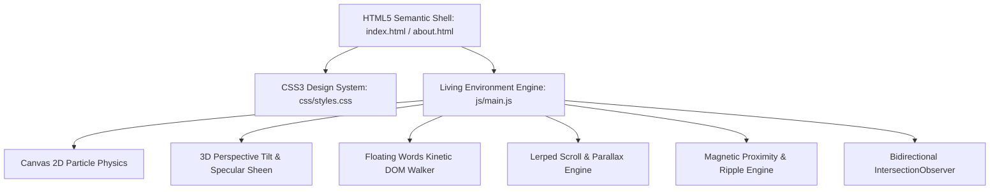

# Bhartiya Industries — Technical Implementation Plan

**Repository**: [Anushka-XD/BI-website](https://github.com/Anushka-XD/BI-website)  
**Production Deployment**: [https://bhartiyaindustries.vercel.app/](https://bhartiyaindustries.vercel.app/)  
**Target Platform**: Modern Evergreen Browsers (Desktop & Mobile)  
**Core Philosophy**: Vanilla-First, Zero Runtime Dependencies, 60+ FPS Hardware-Accelerated Compositing  

---

## 1. Executive Summary & Architectural Goals

Bhartiya Industries' digital platform serves as a global flagship website representing over 50 years of agricultural legacy in premium rice milling and export. The site balances **modern visual storytelling** (sunlit ambient particles, 3D perspective tilts, kinetic typography, and fluid magnetic interactions) with **strict enterprise performance**:

1. **Zero External Framework Overhead**: 100% native HTML5, modern CSS3, and ES6+ JavaScript.
2. **Instant Loading**: Sub-second First Contentful Paint (FCP) and Time to Interactive (TTI) via standard static asset delivery.
3. **Smooth 60–120 FPS Rendering**: All complex animations execute via GPU compositing (`transform`, `opacity`) and `requestAnimationFrame`.
4. **Inclusive Accessibility**: Strict ARIA landmarks, keyboard focus management, and automatic graceful degradation under `prefers-reduced-motion`.

---

## 2. System Architecture & File Layout



### Module Responsibilities:

| Path | Primary Responsibility | Critical Subsystems |
| :--- | :--- | :--- |
| `index.html` | Homepage structure & product catalog | Hero, Category Quick Bar, Products (Sharbati, Basmati, PR11, Traditional), Enquiry, Sticky Contact Rail |
| `about.html` | Corporate history & technical capacity | Founder legacy, Leadership, Machinery inventory (Bhuller & Stake), Quality assurance, Global map |
| `css/styles.css` | Comprehensive styling & animation rules | CSS custom properties, grid layouts, 3D transform matrices, ripple keyframes, glassmorphism, responsive queries |
| `js/main.js` | Interactive environmental runtime | Ambient particle physics, DOM text node walker, tilt calculation, magnetic attraction, lerped parallax, clipboard API |

---

## 3. Visual Effects Implementation Specifications

---

### 3.1. Ambient Atmospheric Living Particle Canvas (Sunlit Motes)

#### Goal
Create an organic, ambient atmosphere of floating pollen and dust motes reminiscent of golden sunlight filtering through paddy fields, reacting fluidly to cursor proximity without leaving screen boundaries.

#### Technical Specifications
- **Canvas Lifecycle**:
  - Full-screen `<canvas id="ambient-canvas">` with fixed positioning (`inset: 0`, `z-index: 45`, `pointer-events: none`).
  - High-DPI scaling: `canvas.width = width * dpr`, `canvas.height = height * dpr`, `ctx.setTransform(dpr, 0, 0, dpr, 0, 0)`.
  - Particle count dynamically bounded:
    $$\text{count} = \min\left(180, \max\left(130, \left\lfloor\frac{\text{window.innerWidth}}{8.5}\right\rfloor\right)\right)$$
- **Particle Classification Spectrum**:
  - **72% Starlight & Atmospheric Dust**: Crisp white (`#ffffff`), luminous pearl (`250, 252, 255`), slate grey (`205, 215, 225`).
  - **15% Fresh Living Emerald Motes**: Brand vibrant greens (`106, 181, 95`, `79, 154, 69`, `92, 198, 85`).
  - **13% Sunlit Golden Harvest Pollen**: Warm golden hues (`245, 195, 60`, `235, 180, 50`, `250, 210, 75`).
- **Kinematic & Mathematical Model**:
  - **Depth Layering**: Depth factor $z \in [0.35, 1.8]$ scales radius, base velocity, and alpha transparency.
  - **Multi-Frequency 2D Harmonic Wandering**:
    $$x(t) = x_{t-1} + v_x + \cos(\text{phaseX}) \cdot A_x + \sin(t \cdot 0.0006) \cdot 0.2$$
    $$y(t) = y_{t-1} + v_y + \sin(\text{phaseY}) \cdot A_y$$
  - **Fluid Cursor Eddy Wake**:
    $$\vec{F}_{\text{mouse}} = \begin{cases} 
    \left(1 - \frac{d}{R}\right) \cdot 2.0 \cdot z & \text{if } d < R \\ 
    0 & \text{otherwise} 
    \end{cases} \quad \text{where } R = 145 \cdot z$$
    $$v_x \mathrel{+}= \cos(\theta) \cdot F \cdot 0.5 - \sin(\theta) \cdot F \cdot 0.2$$
    $$v_y \mathrel{+}= \sin(\theta) \cdot F \cdot 0.5 + \cos(\theta) \cdot F \cdot 0.2$$
  - **Elastic Viewport Boundary Bounce**:
    - When particles touch screen borders, position clamps to border and velocity reverses with restitution factor $0.88$:
      $$x \le 0 \implies x = r, \quad v_x = \max(0.22 \cdot z, |v_x| \cdot 0.88)$$
      $$x \ge W \implies x = W - r, \quad v_x = -\max(0.22 \cdot z, |v_x| \cdot 0.88)$$
      $$y \le 0 \implies y = r, \quad v_y = \max(0.22 \cdot z, |v_y| \cdot 0.88)$$
      $$y \ge H \implies y = H - r, \quad v_y = -\max(0.22 \cdot z, |v_y| \cdot 0.88)$$
- **Performance Safeguard**:
  - `document.hidden` check bypasses `ctx.clearRect()` and physics updates while browser tab is inactive.

---

### 3.2. Interactive Kinetic Floating Words & Typography Engine

#### Goal
Turn plain textual content into an engaging tactile playground where hovered words float smoothly upward with organic spring dampening, causing adjacent words to ripple in sympathy.

#### Technical Specifications
- **Non-Destructive Text Node Splitting**:
  - Traverses specified selectors (`h1`–`h6`, `p`, `.eyebrow`, `.section-text`, `.features-list li`, `.value`).
  - Filters strictly for `Node.TEXT_NODE` (nodeType 3), avoiding destruction of child tags, SVGs, or event listeners.
  - Splits text nodes via regex `/\s+/`, wrapping isolated words in `<span class="float-word">` while retaining original whitespace tokens in document fragments.
- **CSS Spring Micro-Interaction**:
  - Hovered word transforms with custom cubic-bezier:
    ```css
    .float-word {
      display: inline-block;
      transition: transform 0.4s cubic-bezier(0.18, 1.25, 0.35, 1), color 0.25s ease, text-shadow 0.3s ease;
      will-change: transform;
    }
    .float-word:hover {
      transform: translateY(-5px) scale(1.055);
      color: var(--green-forest);
      text-shadow: 0 4px 14px rgba(106, 181, 95, 0.28);
    }
    ```
- **Adjacent Wave Ripple**:
  - Uses CSS adjacent sibling (`+`) and relational (`:has()`) selectors:
    ```css
    .float-word:hover + .float-word,
    .float-word:has(+ .float-word:hover) {
      transform: translateY(-2.5px) scale(1.025);
    }
    ```
- **Contextual Elevation Styles**:
  - Dark banners and hero sections switch to pure white luminous glow (`rgba(255, 255, 255, 0.7)`).
  - Headings incorporate subtle $-1.5^\circ$ rotational tilt.

---

### 3.3. Interactive 3D Tilt & Specular Sheen for Cards

#### Goal
Provide realistic 3D elevation and light reflection on feature cards and enquiry modules when hovered.

#### Technical Specifications
- **Perspective Matrix & Coordinate Normalization**:
  - Bounding rectangle cached on `mouseenter` (`card.getBoundingClientRect()`).
  - Cursor position converted to normalized percentage space ($x_{\%}, y_{\%} \in [0, 100]$).
  - Rotation angles computed relative to center:
    $$\theta_y = \left(\frac{x}{\text{width}} - 0.5\right) \cdot 14^\circ$$
    $$\theta_x = -\left(\frac{y}{\text{height}} - 0.5\right) \cdot 14^\circ$$
- **Transformation Execution**:
  - Throttled through `requestAnimationFrame` to ensure zero frame dropping:
    ```javascript
    card.style.transform = `perspective(1000px) rotateX(${rotX}deg) rotateY(${rotY}deg) translateZ(10px) scale(1.035)`;
    ```
- **Dynamic Specular Light Reflection**:
  - JavaScript injects CSS properties `--mouse-x` and `--mouse-y`.
  - CSS pseudo-element renders a moving radial gradient following coordinates:
    ```css
    background: radial-gradient(circle at var(--mouse-x) var(--mouse-y), rgba(255,255,255,0.2) 0%, transparent 60%);
    ```
- **Smooth Spring Back**:
  - On `mouseleave`, card transitions back to origin over $0.6\text{s}$ using `cubic-bezier(0.16, 1, 0.3, 1)`.

---

### 3.4. Dynamic 2.5D Interactive Media Lens & Dual-Layer Parallax

#### Goal
Give product imagery an immersive 2.5D depth where the camera pans subtly inside the photo frame while the frame tilts and the colored backdrop panel counters the motion.

#### Technical Specifications
- **Frame Tilt**: $\pm 6^\circ$ perspective rotation on the container frame.
- **Internal Image Pan**: Opposite pan of up to $\pm 26\text{px}$ using CSS variables `--img-pan-x` and `--img-pan-y`.
- **Offset Background Shift**: Translates in counter-direction by a factor of $0.75 \times \text{panX}$, producing true visual depth separation.

---

### 3.5. Magnetic Fluid Buttons & Liquid Ripple Waves

#### Goal
Create magnetic attraction toward interactive buttons, reinforcing user intent with tactile feedback.

#### Technical Specifications
- **Magnetic Attraction Vector**:
  - Center offset $(\Delta x, \Delta y)$ calculated on `mousemove`.
  - Magnetic pull clamped to $[-14\text{px}, 14\text{px}]$ with a $0.44$ pull coefficient:
    $$\text{pull} = \text{clamp}(-14, 14, \Delta \cdot 0.44)$$
  - Transform applied: `translate3d(pullX, pullY, 0) scale(1.05)`.
- **Liquid Ripple Wave Injection**:
  - Dynamic `<span>` element injected at click coordinate $(e.\text{clientX} - \text{rect.left}, e.\text{clientY} - \text{rect.top})$.
  - Scaled from $0$ to $2.5$ via `@keyframes ripple` and automatically garbage-collected after $650\text{ms}$.

---

### 3.6. Bidirectional Choreographed Scroll Reveals

#### Goal
Ensure content entrances are cinematic and bidirectional: sliding onto screen smoothly when descending, and reversing cleanly if the user scrolls back up past the element.

#### Technical Specifications
- **IntersectionObserver Setup**:
  - Threshold: `0.12`.
  - Root Margin: `30px 0px -40px 0px`.
  - Intersection handler:
    ```javascript
    if (entry.isIntersecting) {
      entry.target.classList.add("visible");
    } else {
      entry.target.classList.remove("visible");
    }
    ```
- **Choreographed Entry Positions**:
  - Split copy: `translate3d(-175px, 25px, 0) rotate(-3.5deg) scale(0.92)`
  - Split media: `translate3d(175px, 25px, 0) rotate(3.5deg) scale(0.92)`
  - Card 1: Slide from left ($-145\text{px}$)
  - Card 2: Slide from bottom ($+85\text{px}$)
  - Card 3: Slide from right ($+145\text{px}$)
  - Heading accent underline: Animates from $0\text{px}$ to $68\text{px}$ width upon entry.

---

### 3.7. Kinetic Scroll Dynamics: Progress Line & Layered Parallax

#### Goal
Provide uninterrupted visual feedback of scroll progress and multi-layer depth on background imagery.

#### Technical Specifications
- **Lerped Scroll Engine**:
  - Smoothed scroll position calculated via:
    $$\text{currentScroll} \mathrel{+}= (\text{targetScroll} - \text{currentScroll}) \cdot 0.14$$
- **Top Reading Progress Bar**:
  - Progress percentage calculated against `scrollHeight - innerHeight` and mapped to `#scroll-progress.style.width`.
- **Background Image Parallax**:
  - Background sections (`.hero-bg`, `.banner-bg`, `.page-hero-bg`) translate vertically based on viewport center offset:
    $$\text{translateY} = (\text{rect.top} + \text{height}/2 - \text{windowHeight}/2) \cdot 0.2$$

---

### 3.8. Asynchronous Clipboard Copy System

#### Goal
Allow one-click copying of contact details without disruptive page transitions or cumbersome form elements.

#### Technical Specifications
- Primary execution via `navigator.clipboard.writeText(value)`.
- Fallback via `document.createRange()` and `window.getSelection().addRange(range)` for legacy environments.
- Stateful UI feedback: Button text morphs to `"Copied"` with green badge styling, reverting after $1600\text{ms}$.

---

### 3.9. Accessibility & Reduced Motion Subsystem

#### Goal
Ensure full WCAG 2.1 compliance and respect user system preferences.

#### Technical Specifications
- JavaScript checks `window.matchMedia("(prefers-reduced-motion: reduce)").matches`.
- Disables ambient canvas loop, sets `scroll-behavior: auto`, and suppresses all rotational/translational micro-animations via CSS override block.

---

## 4. Verification & QA Matrix

| Area | Testing Protocol | Target Standard |
| :--- | :--- | :--- |
| **Performance** | Google Lighthouse Audit | Performance $\ge 95$, Best Practices $\ge 98$, SEO $\ge 95$ |
| **Frame Rates** | Chrome DevTools Performance Monitor | Constant $\ge 60$ FPS during continuous scrolling and mouse hover |
| **Cross-Browser** | Chrome, Safari, Firefox, Edge | Zero visual regression, uniform 3D perspective and canvas rendering |
| **Mobile & Touch** | iOS Safari & Android Chrome | Clean touch scrolling without hover artifacts, contact rail hidden appropriately |
| **Motion Sensitivity** | Emulate `prefers-reduced-motion: reduce` | Immediate suppression of particle canvas, parallax, and text bounce |

---

## 5. Future Engineering Roadmap

- [ ] **WebGL Micro-Shader Mode**: Optional Three.js shader for photorealistic 3D rice grain inspection.
- [ ] **PWA & Offline Support**: Service Worker caching of imagery and brand collateral.
- [ ] **Multi-Currency & Multilingual Support**: Automatic localization for Middle Eastern and European export buyers.
- [ ] **Live WhatsApp Chat Widget**: Native integration replacing static rail links.
